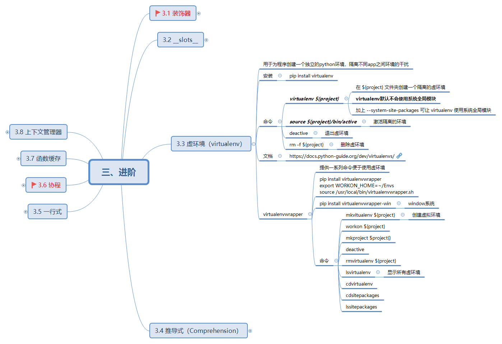

# virtualenv


用于为程序创建一个独立的python环境，隔离不同app之间环境的干扰
```shell
pip install virtualenv
```

| 命令                         | 描述                                     | 备注                               |
| ---------------------------- | ---------------------------------------- | ---------------------------------- |
| virtualenv ${project}        | 在 ${project} 文件夹创建一个隔离的虚环境 | 默认不会使用系统全局模块 |
| source ${project}/bin/active | 激活隔离的环境                           | source ${project}/Scripts/active   |
| deactive                     | 退出虚环境                               |                                    |

安装 virtualenvwrapper（提供一系列命令便于使用虚环境）
```shell
pip install virtualenvwrapper
```

## 实例
1、创建虚拟环境
```shell
$ cd python\py-note

$ virtualenv venv
Using base prefix 'c:\\install\\dev\\python'
New python executable in d:\python\py-note\venv\Scripts\python.exe
Installing setuptools, pip, wheel...
done.
```
会创建一个 venv 目录，其中包含了 python 解释器、标准库等目录。

2、激活环境
```shell
$ source venv/Scripts/activate
(venv)

# windows 下
$ ./vemv/Scripts/activate.bat
```

3、安装依赖: 安装当前项目需要的依赖
```shell
$ pip install xxx
```

4、导出目前的依赖
```shell
# 查看依赖
$ pip freeze
configparser==4.0.2
virtualenv==16.7.9

$ pip freeze > requirements.txt
```

5、退出环境
```shell
$ deactivate
```
